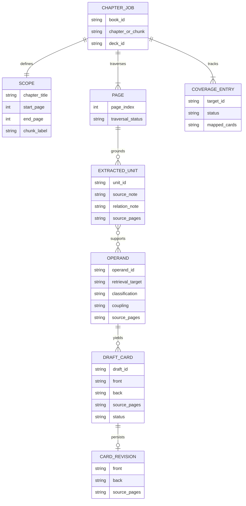
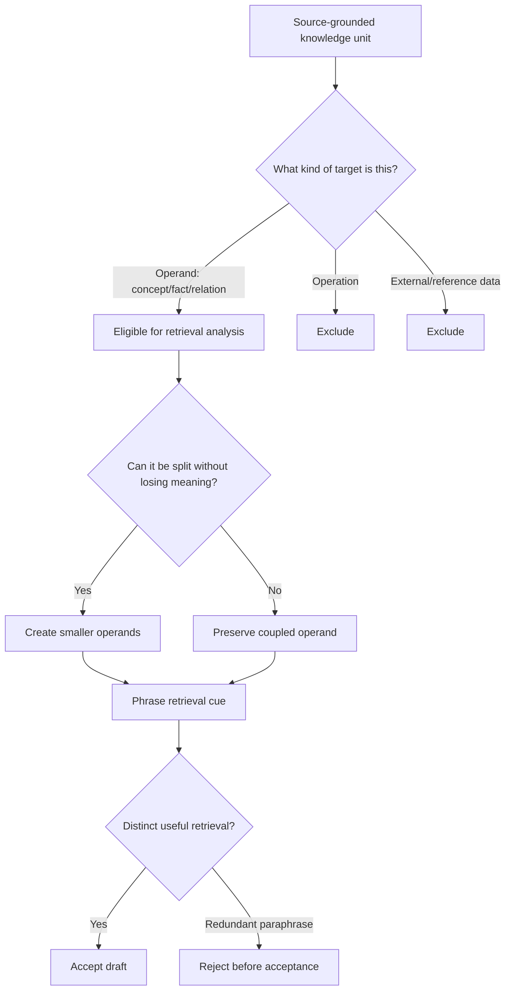
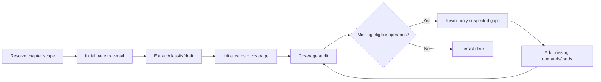

# Designing a Chapter-Level Flashcard-Generation Skill for a Tool-Using Study Agent

## Executive summary

This report treats the conclusions of the two prior flashcard/learning-science papers as fixed design premises rather than re-deriving them. The engineering question is therefore not *what makes a good retrieval flashcard*, but **how a capable study agent should reliably transform a completed textbook chapter into a maximally covering, source-grounded Q&A deck while spending as little prompt and agent effort as is consistent with those requirements**.

The assumed model class is unusually capable. As of August 28, 2026, OpenAI documents GPT-5.6 Sol as its flagship model for complex professional work, with image input, MCP/tool support, Skills support, a 1.05-million-token context window, and up to 128,000 output tokens. Those capabilities make all four architectures technically feasible without resorting to a swarm of specialized subagents. citeturn2view3 OpenAI's current GPT-5.6 guidance is also directly relevant to the prompt-design objective here: it recommends **leaner prompts, stating each instruction once, exposing only relevant tools, and explicitly defining autonomy boundaries**. OpenAI reports that leaner system prompts improved both evaluation scores and token use in an internal coding-agent sample, while cautioning that the effect must be validated on the actual workload. citeturn3view0 More general reasoning-model guidance similarly recommends straightforward, direct prompts rather than elaborate "think step by step" scaffolding. citeturn2view2

The main conclusion is that the four proposed architectures are genuinely different because they place the lossy decisions at different points in the pipeline:

| Architecture | Defining decision | Best property | Principal weakness | Recommended role |
|---|---|---|---|---|
| **Inventory-first** | Classify and inventory all operands before writing any cards | Auditability | Early classification can already compress/distort source | Conservative, inspectable baseline |
| **Section-streaming** | Extract, classify, and card locally while traversing pages | Efficiency and local grounding | Weakest chapter-global view | Cost/latency-sensitive default |
| **Extract-then-transform** | Preserve source units first; classify and card only afterward | Source fidelity and coupling preservation | More intermediate state and model work | **Best overall architecture** |
| **Iterative coverage-audit** | Draft once, then search specifically for omissions | Strongest coverage pressure | Highest and least predictable compute | Coverage-critical chapters |

My overall recommendation is **extract-then-transform**. Its key advantage is not merely that it has "more passes." It separates the two mistakes that are most difficult to recover from: *failing to notice source content* and *misrepresenting noticed content during card optimization*. The first pass records source-grounded knowledge before deciding whether it is an operand, operation, or external datum; later stages can therefore reconsider classification and atomization without having to reconstruct the source from already-compressed cards. This creates a useful information bottleneck only **after** a source-faithful artifact exists.

The **iterative coverage-audit architecture** ranks second and should win when omission is materially worse than excess compute. It explicitly treats coverage as a repairable property: produce a first deck, compare the deck's coverage against the chapter-level extraction/coverage record, revisit only suspected gaps, and add missing cards. Critically, this audit is **not a source-verification pass**. It does not reread every accepted card against its page. Its question is "what eligible operands remain unrepresented?", not "are the existing cards correct?"

**Section-streaming** is likely to be the cheapest and operationally simplest approach. It takes maximal advantage of local context, minimizes intermediate serialization, and should have the lowest normal latency. It is therefore a strong practical architecture when chapters are structurally simple. Its weakness is that relationships spanning distant parts of a chapter become harder to recognize, and omissions are harder to diagnose after the fact.

**Inventory-first** is a useful conservative baseline because it produces a clean, auditable operand ledger before card generation. However, it makes the classification/atomization layer carry too much epistemic responsibility: a fact that disappears from `operands.json` has effectively disappeared before card generation begins. Extract-then-transform preserves a less-committal source representation before making that decision.

The architecture should not attempt to exploit GPT-5.6 Sol's million-token context by simply loading an entire book—or even necessarily an entire long chapter—and asking for flashcards. A large context window is a capacity ceiling, not a reason to maximize context. OpenAI recommends supplying relevant context rather than indiscriminately enlarging it, and the established "Lost in the Middle" literature shows that long-context retrieval quality can vary with information position, although that study predates GPT-5.6 and therefore should be treated as a conservative systems-design warning rather than a benchmark of the current model. citeturn4view3turn1search2 Page-level traversal with **local, on-demand neighboring context** is consequently the right default for the stated problem.

Across all four architectures, four design choices should remain invariant:

**First, provenance is captured when knowledge is extracted, not reconstructed afterward.** An intermediate artifact may internally represent provenance as `[41, 42]`; when the final card is persisted, it becomes `source_pages = "41,42"`. No separate "verify every card" pass is needed.

**Second, coverage is a two-layer property.** Every source page must be traversed, and every *identified eligible operand* must map to at least one accepted card or an explicit reason that no card is needed. The second condition alone is insufficient: an inventory can be 100% covered while still having missed source material. This distinction is why the architectures differ meaningfully in coverage assurance.

**Third, dynamic atomization belongs before question wording.** The agent should determine the smallest source-faithful retrieval unit first and only then phrase a ≤10-word cue and normally ≤5-word answer. The wording constraint should not be allowed to force an intrinsically coupled operand apart.

**Fourth, "do not auto-merge/deduplicate accepted cards" does not prohibit rejecting redundant drafts.** Redundancy control should operate as an **admission rule**. Before accepting a new draft, the agent may decide that it asks essentially the same retrieval question about the same operand as an existing draft. Once both cards have been legitimately accepted, there is no later semantic consolidation pass that merges them merely because they look similar.

The artifact graph that best supports these invariants is small:



This is intentionally an **analytical artifact model, not a database proposal**. The actual persistence contract remains the supplied SQLite schema.

## Common design contract and intermediate artifacts

The flashcard generator should behave as a **skill invoked by an existing study agent**, not as that agent's full identity. That distinction matters. The study agent already knows the learner, reading session, current chapter, and general interaction style. The skill therefore needs to specify only the additional behavior required when the learner says, in effect, "we're done studying this chapter; create the deck."

This matches contemporary agent runtimes conceptually: tools expose executable capabilities, resources expose contextual data, and an agent can maintain persistent working state across multiple tool calls. The current MCP specification explicitly separates model-invokable **tools** from contextual **resources**, while OpenAI's Agents SDK distinguishes persistent sessions/context from tool execution and explicitly describes artifact-producing, multi-step work as an appropriate agent workflow. citeturn2view6turn2view7turn2view4 None of that requires the skill prompt to name an MCP function. "Fetch page image" and "write artifact" are the correct abstraction level for this research.

### Scope resolution

The input job is **one completed chapter**. TOC metadata is useful for finding the chapter and neighboring major boundaries, but it should not be treated as a complete semantic decomposition of the chapter. The agent discovers internal structure while reading.

For a normal chapter:

```text
job scope = chapter
deck scope = chapter
```

For an unusually large chapter:

```text
job scope = chapter
deck scopes = a few large logical chunks
```

There should be no fixed page-count threshold in the research prompt because "too large" has deliberately been left unspecified. A better decision rule is semantic: split only when the chapter contains multiple large conceptual regions such that treating the whole thing as one generation unit would materially impair source traversal, artifact manageability, or global operand reasoning. The split should occur at a **major conceptual transition discovered from the page material**, not mechanically at every TOC subsection.

A chapter such as:

```text
Chapter: Cardiovascular Physiology
  Cardiac mechanics
    ...
  Hemodynamics
    ...
  Microcirculation
    ...
  Blood-pressure regulation
    ...
```

might warrant two or three large chunks if enormous. It should not automatically become four section-sized decks merely because four headings exist.

### The common card contract

The final semantic payload is exactly the persistence structure supplied by the user:

| Field | Meaning | Skill-level constraint |
|---|---|---|
| `front` | Retrieval cue | Natural language; normally ≤10 words; minimally sufficient to identify the intended retrieval |
| `back` | Retrieval target | Normally ≤5 words; longer only when irreducible source content requires it |
| `source_pages` | Textbook provenance | One page or comma-separated page indices, e.g. `"143"` or `"143,144"` |

`book_id`, `deck_id`, `card_id`, and `revision` are persistence identities rather than flashcard-content design variables.

An internal artifact should preferably carry pages as an integer list:

```json
"source_pages": [143, 144]
```

and serialize them only at the persistence boundary:

```text
143,144
```

That is not a proposed production schema change; it simply avoids treating a comma-formatted string as semantic state during reasoning.

### Operand selection and dynamic atomization

The fixed premises imply the following decision sequence:



The important property is that **atomization is semantic, not syntactic**.

A list may remain one operand when the membership relation *is the thing to remember*:

```text
Question: What are the loop's primary components?
Answer: absorber, transfer line, radiator
```

Breaking it into:

```text
What is one primary component?
What is another primary component?
```

would make the retrieval target underdetermined.

Conversely, a mapping can often be split cleanly:

```text
Orange lamp → reserve cooling active
Blue lamp → normal circulation
```

because each cue uniquely identifies its own answer.

Likewise, one underlying source relation may legitimately produce more than one card when the retrieval demands differ:

```text
Which devices form the safety interlock?
S2 and valve K

If S2 fails, what happens?
Valve K closes
```

Those are not paraphrases. One retrieves membership; the other retrieves causal behavior.

### Common intermediate artifacts

A small artifact vocabulary is sufficient:

| Artifact | Purpose | Example contents |
|---|---|---|
| `scope.md` | Records chapter/chunk scope and page range | `Chapter 7 — pages 141–178; one deck` |
| `extraction.md` | Page-grounded source notes before or during transformation | `p143 unit U17: term X is defined as Y; relation to U18` |
| `operands.json` | Eligible/ineligible knowledge units and coupling state | operand IDs, retrieval targets, classifications, page arrays |
| `coverage.md` | Tracks source traversal and operand-to-card coverage | page status; eligible operand → draft IDs |
| `draft_cards.json` | Candidate/accepted cards before persistence | `front`, `back`, page arrays, operand IDs, status |

Not every architecture needs all five artifacts. Requiring all five regardless of purpose would undermine the prompt/token-economy objective.

A representative `operands.json` might look like:

```json
[
  {
    "operand_id": "op-041-01",
    "retrieval_target": "primary components of the Luma loop",
    "answer": "absorber, transfer line, radiator",
    "classification": "operand",
    "coupling": "irreducible membership set",
    "source_pages": [41],
    "card_ids": ["draft-001"]
  },
  {
    "operand_id": "op-042-01",
    "retrieval_target": "devices coupled by the safety interlock",
    "answer": "S2 and valve K",
    "classification": "operand",
    "coupling": "cross-page relation",
    "source_pages": [42, 43],
    "card_ids": ["draft-004"]
  },
  {
    "operand_id": "x-043-01",
    "retrieval_target": "restart procedure",
    "classification": "operation",
    "source_pages": [43],
    "card_ids": []
  },
  {
    "operand_id": "x-043-02",
    "retrieval_target": "nominal pressure from service label",
    "classification": "external_data",
    "source_pages": [43],
    "card_ids": []
  }
]
```

A representative `draft_cards.json`:

```json
[
  {
    "draft_id": "draft-001",
    "operand_ids": ["op-041-01"],
    "front": "What are the loop's primary components?",
    "back": "absorber, transfer line, radiator",
    "source_pages": [41],
    "status": "accepted"
  },
  {
    "draft_id": "draft-004",
    "operand_ids": ["op-042-01"],
    "front": "Which devices form the safety interlock?",
    "back": "S2 and valve K",
    "source_pages": [42, 43],
    "status": "accepted"
  },
  {
    "draft_id": "draft-011",
    "operand_ids": ["op-041-01"],
    "front": "Name the Luma loop's main components.",
    "back": "absorber, transfer line, radiator",
    "source_pages": [41],
    "status": "rejected",
    "reason": "redundant paraphrase of draft-001"
  }
]
```

The rejection example is important: **avoiding redundant paraphrases does not require a post-hoc deduplication pass**.

### Coverage should be measured at two levels

A useful conceptual distinction is:

\[
\text{Traversal coverage}
=
\frac{\text{pages actually processed}}{\text{pages in scope}}
\]

and:

\[
\text{Internal operand coverage}
=
\frac{\text{eligible operands mapped to ≥1 accepted card}}
{\text{eligible operands identified}}
\]

The target for both is 100%.

But the second quantity has an epistemic blind spot. If the agent simply failed to identify an operand, it never enters the denominator. Therefore:

> **100% artifact coverage is not proof of 100% source coverage.**

The four architectures differ largely in how much protection they provide against that blind spot.

### Prompt-design implications

OpenAI's current guidance for GPT-5.6 specifically favors removing repeated instructions, keeping tool descriptions concise, stating each instruction once, and making autonomy boundaries explicit. citeturn3view0 OpenAI also advises precise requirements and clear end-state criteria rather than unnecessary chain-of-thought prompting. citeturn2view2 That suggests a skill prompt should express:

1. **goal**,
2. **scope**,
3. **source/grounding rule**,
4. **operand/card rules**,
5. **architecture-specific workflow**,
6. **completion criterion**,
7. **autonomy boundary**.

It should *not* spend tokens explaining why retrieval practice works, defining the study agent's personality, reprinting database DDL, narrating implementation details, or instructing the model to expose its reasoning.

OpenAI also recommends evaluating model behavior on task-specific, representative cases rather than relying on generic metrics or subjective "it seems good" judgments. citeturn5search0 Consequently, the architecture rankings later in this report are **analytical priors**, not substitutes for a chapter-level evaluation corpus.

## Inventory-first architecture

Inventory-first makes the **operand inventory the central intermediate representation**. The agent traverses the complete chapter or chunk, identifies and classifies every candidate item, stabilizes `operands.json`, and only then writes cards.

The core principle is:

> **Do not let card phrasing influence what you think the chapter contains.**

Unlike extract-then-transform, however, inventory-first still asks the first pass to decide what counts as an operand.

### Workflow


The agent begins with TOC metadata and the learner's completed-chapter state. It establishes a provisional chapter range, then traverses every page. When a page begins or ends in the middle of an explanation, the agent fetches neighboring pages as necessary rather than importing the entire book into working context.

For each page, it asks:

- What stable concepts, facts, mappings, relations, formulas, lists, distinctions, or other operands are explicitly asserted?
- Which material represents an operation rather than a memory target?
- Which values or facts are explicitly intended to be obtained from an external reference rather than remembered?
- Which candidate items belong together because separating them would destroy the relation the learner needs to retrieve?

The result goes directly into `operands.json`.

No card wording should be generated until the inventory covers all pages in the chapter or chunk.

A second phase transforms eligible operands into cards. Each eligible operand must map to at least one accepted draft, except where the artifact records an explicit reason that the operand does not require a separate card because it is already fully represented by another *coupled* card. This is different from semantic merging after card acceptance.

The final phase checks the **inventory-to-card mapping**, not the source facts themselves, then persists the deck.

### Illustrative artifacts

| Artifact | Representative content |
|---|---|
| `scope.md` | `Chapter: Heat Control; pages 41–63; unsplit` |
| `operands.json` | `op-041-03: PX-7 melting point → 48°C; pages [41]` |
| `coverage.md` | `p41: scanned ✓; op-041-01 → draft-001; op-041-03 → draft-003` |
| `draft_cards.json` | `At what temperature does PX-7 melt? → 48°C` |

A compact `coverage.md` could be human-readable:

```text
# Source traversal

41 ✓  operands op-041-01..03
42 ✓  operands op-042-01
43 ✓  operands op-043-01..04; excluded x-043-01..02

# Operand coverage

op-041-01 -> draft-001 ✓
op-041-02 -> draft-002 ✓
op-041-03 -> draft-003 ✓
op-042-01 -> draft-004 ✓
op-043-01 -> draft-005 ✓
...
```

The artifact is deliberately boring. Its job is to make omissions visible, not to reproduce the chapter.

### Illustrative skill prompt

```text
# Flashcard generation — inventory-first

When the learner asks for flashcards for a completed chapter, create one
deck for that chapter. If the chapter proves unusually large, divide it
only into a few large logical chunks discovered from the material; do not
make one deck per section.

Use TOC metadata to locate the chapter, then process every page image in
scope. Read pages in order and fetch nearby pages when local context is
needed.

Before drafting any cards, build an inventory of the chapter's knowledge.
Identify all source-grounded operands and record their source page(s).
Exclude operations and external/reference data. Atomize dynamically:
separate independently retrievable facts, but preserve lists, mappings,
conditions, or other relations whose meaning would be lost by splitting.

Only after the inventory is complete, turn every eligible operand into one
or more useful Q&A retrieval cards. Questions should normally use at most
10 words and answers at most 5 words; allow longer irreducible lists,
formulas, or similarly compact source content. Give each question only the
context needed to identify one retrieval target. Distinct retrievals from
one operand are allowed; redundant paraphrases are not.

Track that every page was processed and every eligible operand is
represented by an accepted card. Capture provenance during extraction and
carry it forward. Do not perform a separate source-verification pass and
do not merge already accepted cards.

Write the deck and card revisions with front, back, and comma-separated
source_pages. Work autonomously until complete unless the source cannot be
accessed.
```

### Coverage assurance

Inventory-first provides **strong internal coverage assurance** because `operands.json` creates an explicit denominator. If it contains 137 eligible operands and all 137 map to cards, card-generation coverage is inspectable.

Its weakness is that the inventory is also the first lossy representation. If the model reads a paragraph and silently reduces six learnable relations to four inventory items, every downstream check can pass perfectly.

The architecture therefore ensures:

```text
all inventoried operands → cards
```

much more strongly than it ensures:

```text
all true source operands → inventory
```

This distinction is central.

### Strengths and weaknesses

Its strongest advantage is **auditability**. A developer can inspect the exact intermediate question, "what did the agent believe the chapter contained before writing cards?" That is valuable when diagnosing systematic under-generation.

It also creates a useful chapter-global view. If the same concept appears on pages 8, 19, and 32 with different properties, the inventory can retain those relationships before the agent phrases any cue.

The weakness is **premature abstraction**. Classification, atomization, and source compression happen simultaneously. Once the page becomes:

```text
op-017: X causes Y
```

details about qualifiers, contrast structure, or neighboring relations may have been discarded. Card generation cannot recover them without going back to the page, and the stated design does not include a later universal verification pass.

### Token economy and prompt simplicity

The prompt itself is simple. The cost comes from the artifact.

Inventory-first serializes essentially the whole chapter's retrievable semantic inventory before producing the final deck. Since final flashcards are very short, intermediate inventory output may substantially exceed final deck output.

It normally requires:

```text
page traversal       once
operand serialization once
card transformation   once
coverage mapping      once
```

It should still be much cheaper than rereading every page for verification, which this design explicitly avoids. More generally, reducing unnecessary requests and tokens reduces cost and usually latency, according to OpenAI's optimization guidance. citeturn5search9

### Recommended use cases

Inventory-first is strongest when:

- developers want a transparent artifact for studying failure modes;
- the source is reasonably structured;
- chapter-global coverage matters more than absolute minimal cost;
- classification into operand/operation/external data is relatively straightforward;
- debugging missing cards is a major requirement.

It is the best **baseline architecture for an evaluation program**, because its failure states are unusually inspectable.

## Section-streaming architecture

Section-streaming treats the chapter as a **progressive source stream** rather than a source to model globally before card generation. The agent processes pages or small coherent page windows, discovers local structure, extracts operands, drafts cards immediately, and advances while carrying a lightweight coverage ledger.

"Section-streaming" should not be interpreted as "one deck per textbook section." The deck remains chapter- or large-chunk-level. "Section" describes the model's local working unit.

Its principle is:

> **Make the card while the source context is freshest.**

### Workflow


For each local window, the agent performs the full transformation:

```text
page source
   ↓
candidate knowledge
   ↓
operand classification
   ↓
dynamic atomization
   ↓
card wording
   ↓
accepted card
```

The coverage ledger carries forward only what is needed to prevent forgotten work:

```text
page 141 done
page 142 done
page 143 needs continuation on 144
op-143-04 pending until continuation
```

When page 144 is fetched, `op-143-04` can be completed and carded.

The agent does **not** wait for a chapter-wide inventory before drafting.

### Illustrative artifacts

This design should deliberately use fewer artifacts:

| Artifact | Representative content |
|---|---|
| `scope.md` | chapter/chunk range |
| `stream_log.md` | page/window status and unresolved continuations |
| `coverage.md` | local operands and resulting cards |
| `draft_cards.json` | cumulative accepted/rejected drafts |

For example:

```text
# stream_log.md

p41 COMPLETE
  op-041-01 -> draft-001
  op-041-02 -> draft-002
  op-041-03 -> draft-003

p42 CONTINUES
  relation: safety interlock begins with S2
  pending: fetch p43 before atomization

p43 COMPLETE
  completed p42 relation -> op-042-01 -> draft-004
  op-043-01 -> draft-005
  op-043-02 -> draft-006
  excluded restart sequence: operation
  excluded nominal-pressure lookup: external_data
```

`draft_cards.json` itself can double as much of the operand ledger because each card is created while the operand is still in local context.

### Illustrative skill prompt

```text
# Flashcard generation — section-streaming

Create a deck for the completed chapter, or for a few large logical chunks
if the chapter is unusually large. Do not split merely because the chapter
has sections.

Use TOC metadata to locate the chapter. Process every page image in order,
working in the smallest local page range that gives enough context.
Expand to neighboring pages when a definition, relation, list, or argument
crosses a page boundary.

As each local unit is understood, identify all textbook-grounded operands,
excluding operations and external/reference data. Atomize each operand only
as far as meaning permits; preserve important couplings.

Draft its cards while that source context is active. Questions should
normally be at most 10 words and answers at most 5 words, except for
irreducible lists, formulas, sequences, or similar compact content.
Use minimal context sufficient for unique retrieval. Allow multiple cards
for genuinely different retrievals from one operand. Reject redundant
paraphrases before accepting them.

Record source pages when the operand is identified. Maintain a lightweight
ledger showing every page processed, unresolved cross-page material, and
the card(s) representing each eligible operand.

Continue until all pages are processed and the ledger has no unresolved
eligible operands. Do not reread the chapter solely to verify accepted
cards and do not merge accepted cards.

Persist front, back, and comma-separated source_pages. Work autonomously
unless source access fails.
```

### Coverage assurance

Streaming establishes coverage incrementally:

```text
page processed
→ candidate items handled
→ eligible operands carded
→ page closed
```

A page should not be marked complete until all locally recognized candidates have been classified and any cross-page dependencies recorded.

This is efficient but produces the weakest defense against a **silent local omission**. Suppose the agent processes page 88, notices five operands, cards all five, and closes the page. The ledger shows 100% completion even if a sixth operand was overlooked.

Inventory-first has the same fundamental blind spot, but its global operand representation gives the model another opportunity to notice relationships across entries. Streaming does not naturally create that opportunity.

### Source fidelity and coupling

Streaming is particularly good at **local source fidelity**. Card wording happens while the page and its immediate neighbors are still the active context, so there is minimal intermediate semantic compression.

That makes it attractive for dense textbooks where sentence-level qualifiers matter.

Its corresponding weakness is **nonlocal coupling**. Consider a chapter that introduces a category on page 7, gives two members on page 14, and adds an exception on page 31. A streaming agent can represent all three correctly but may not recognize that they should be modeled as one coupled operand unless its lightweight state preserves that relationship.

Therefore the ledger should carry **open conceptual references**, not just page checkmarks.

### Strengths and weaknesses

Section-streaming has the cleanest execution model and the smallest working artifacts. It aligns naturally with the user's page-level processing requirement and avoids asking the model to repeatedly transform a large chapter-wide summary.

It should also give excellent page-level provenance because the card is born close to the source evidence.

Its main weaknesses are:

- poorer chapter-global synthesis;
- greater sensitivity to omissions that occur during one local pass;
- weaker discovery of widely separated couplings;
- cards generated early cannot benefit from later chapter context unless the architecture permits new distinct cards—which it does—but accepted cards are not rewritten or merged.

That last property actually fits the user's "do not auto-merge accepted cards" rule well, but it means early card wording must be locally sufficient.

### Token economy and prompt simplicity

This is the clear winner on efficiency.

A successful run approximates:

```text
page read → small artifact update → cards
```

rather than:

```text
page read → source artifact → operand artifact → card artifact
```

It has few duplicated semantic representations and very short persistent state.

The prompt is also easiest to express because execution mirrors reading order. This matters for GPT-5.6 specifically: current official guidance says leaner prompts and concise tool descriptions can improve both performance and token efficiency, while autonomy should be specified compactly rather than repeatedly. citeturn3view0

### Recommended use cases

Section-streaming is best when:

- chapters are moderately sized and locally organized;
- most operands are established within a page or neighboring pages;
- cost and latency matter;
- the model has already read the chapter with the learner and may retain useful study-session context;
- operational simplicity is a priority;
- evaluations show acceptable omission rates without a second extraction representation.

It is the architecture I would test as the **efficiency challenger** against extract-then-transform.

## Extract-then-transform architecture

Extract-then-transform deliberately separates **source noticing** from **flashcard ontology**.

Its principle is:

> **First preserve what the textbook says; only afterward decide what deserves a card.**

This distinction makes it more than a verbose inventory-first pipeline.

Inventory-first asks, during source traversal:

```text
Is this an operand?
```

Extract-then-transform first asks:

```text
What knowledge is explicitly present here, and how is it related?
```

Only the next phase asks whether each unit is an operand, operation, or external datum and how it should be atomized.

That extra layer is the architecture's principal advantage.

### Workflow


The first pass creates **source units**. These should remain close enough to the textbook to preserve relationships but should not reproduce pages verbatim.

A source unit might record:

```text
U-042-03 | pages 42,43
S2 and valve K are presented as the two coupled devices of the safety
interlock. The statement crosses the page boundary.
```

At this stage, the model should *not yet decide*:

```text
operand?
two operands?
one card?
two cards?
```

The next pass transforms source units into the memory-target ontology:

```text
U-042-03
  ↓
operand: interlock membership
  answer: S2 and valve K
  coupling: preserve pair
  pages: [42,43]
```

Only then does card phrasing occur:

```text
Which devices form the safety interlock?
S2 and valve K
```

This creates three semantically distinct representations:

```text
source-grounded unit
→ retrieval operand
→ flashcard
```

That sounds expensive, but each representation answers a different diagnostic question:

```text
Did we notice it?
Did we classify/atomize it correctly?
Did we cue it correctly?
```

### Illustrative artifacts

This architecture uses the richest artifact set:

| Artifact | Representative content |
|---|---|
| `scope.md` | chapter range and any macro-chunk split |
| `extraction.md` | source-close knowledge units and relations |
| `operands.json` | classification and dynamic atomization |
| `coverage.md` | source-unit → operand → card mapping |
| `draft_cards.json` | final candidate cards |

Example `extraction.md`:

```text
# Page 41

U-041-01
The Luma loop is described as having three primary components:
absorber, transfer line, radiator.

U-041-02
The absorber is filled with PX-7 salt.

U-041-03
PX-7 has a melting point of 48°C.

# Pages 42–43

U-042-01
A statement beginning on p42 and completing on p43 identifies S2 and
valve K as the two coupled devices of the safety interlock.

# Page 43

U-043-01
Failure of S2 causes valve K to close.

U-043-02
Radiator mode is conditional on 70°C:
passive below it; fan-assisted at or above it.

U-043-03
Orange status means reserve cooling active.
Blue status means normal circulation.

U-043-04
Restart instructions specify holding RESET for three seconds.

U-043-05
Nominal pressure is obtained from the unit's service label.
```

Then:

```json
[
  {
    "operand_id": "op-041-01",
    "from_units": ["U-041-01"],
    "retrieval_target": "Luma loop primary-component set",
    "answer": "absorber, transfer line, radiator",
    "classification": "operand",
    "coupling": "preserve set",
    "source_pages": [41]
  },
  {
    "operand_id": "op-043-02a",
    "from_units": ["U-043-02"],
    "retrieval_target": "condition for passive radiator mode",
    "answer": "below 70°C",
    "classification": "operand",
    "coupling": "paired threshold mapping",
    "source_pages": [43]
  },
  {
    "operand_id": "op-043-02b",
    "from_units": ["U-043-02"],
    "retrieval_target": "condition for fan-assisted mode",
    "answer": "at least 70°C",
    "classification": "operand",
    "coupling": "paired threshold mapping",
    "source_pages": [43]
  },
  {
    "operand_id": "x-043-04",
    "from_units": ["U-043-04"],
    "classification": "operation",
    "source_pages": [43]
  },
  {
    "operand_id": "x-043-05",
    "from_units": ["U-043-05"],
    "classification": "external_data",
    "source_pages": [43]
  }
]
```

Notice that the source representation preserved the **two-sided threshold mapping** before atomization. The transform phase can then decide that two cards are individually cueable without pretending the two conditions were unrelated in the textbook.

### Illustrative skill prompt

```text
# Flashcard generation — extract then transform

Create one deck for the completed chapter, splitting only an unusually
large chapter into a few large logical chunks discovered from its content.

Locate the chapter from TOC metadata and process every page image in scope,
using neighboring pages when local context is required.

First extract the chapter's explicit knowledge into a page-grounded
artifact. Capture concepts, facts, relations, mappings, conditions, lists,
formulas, procedures, and reference-dependent material without yet trying
to phrase flashcards or deciding that everything extracted is an operand.
Preserve cross-page and internally coupled relationships and record their
source pages at extraction time.

Next transform the extraction into an operand inventory. Classify each
unit as operand, operation, or external/reference data. Exclude the latter
two from cards. Dynamically atomize operands: split independently
retrievable knowledge but preserve any coupling whose separation would
lose, distort, or make the target ambiguous.

Then draft cards for every eligible operand. Questions should normally be
at most 10 words and answers at most 5 words, except when the source
requires an irreducible list, formula, sequence, or similar compact unit.
Use only enough context to make each retrieval unique. Multiple genuinely
different retrievals from one operand are allowed; redundant paraphrases
are not.

Maintain mappings from extracted units to operands to accepted cards.
Every page must be processed and every eligible operand represented.
Carry source provenance forward rather than reconstructing it later.
Do not perform a separate source-verification pass or merge accepted cards.

Persist front, back, and comma-separated source_pages. Complete the work
autonomously unless source access fails.
```

### Coverage assurance

This architecture gives three observable coverage layers:

```text
page → extracted source units
extracted units → classifications/operands
eligible operands → cards
```

That is stronger diagnostically than:

```text
page → operands → cards
```

because the classification decision is no longer hidden inside extraction.

Suppose an evaluation says a missing card should have represented an exception stated on page 177.

With inventory-first, diagnosis may be:

```text
Was the exception missed while reading,
or was it read but rejected as an operation,
or was it merged into another operand?
Unknown.
```

With extract-then-transform:

```text
Exception absent from extraction.md
    → extraction failure

Exception present in extraction.md but absent from operands.json
    → classification/atomization failure

Operand present but no card
    → coverage failure

Card present but poorly worded
    → transformation failure
```

That decomposition is extremely useful for research.

### Source fidelity and preservation of coupling

Extract-then-transform receives the highest rating on both criteria because **source relations survive one representation longer before card constraints are imposed**.

The ≤10-word front and ≤5-word back constraints create strong compression pressure. If the model simultaneously tries to notice source content and satisfy those limits, it may unconsciously select only knowledge that is easy to express briefly. The source-extraction stage removes that incentive: the first pass is judged on knowledge preservation, not flashcard elegance.

This is an analytical inference from the workflow, not a claim that has been directly benchmarked for this exact application.

### Strengths and weaknesses

Strengths:

- best separation of failure modes;
- strongest protection against premature card-writing bias;
- excellent preservation of cross-page relations;
- classification decisions are reversible without revisiting images;
- artifacts support unusually good research and evaluation;
- no need for a universal verification pass because the source-grounded extraction remains available.

Weaknesses:

- more output tokens;
- more intermediate state;
- more opportunities for the model to "clean up" an artifact unnecessarily unless instructed to keep extraction source-close;
- slower than streaming;
- somewhat greater operational complexity because artifact handoff matters.

OpenAI's agent tooling explicitly supports persistent session state and multi-step artifact-oriented workflows, so this style is well within the intended capability envelope of current agent runtimes. citeturn2view4turn2view5

### Token economy and prompt simplicity

This is not the token winner. It deliberately pays for an intermediate representation.

However, it need not reread page images for every transformation. The expensive source interaction is:

```text
images → extraction
```

Later phases operate on the smaller textual artifacts:

```text
extraction → operands → cards
```

This matters because the architecture is **multi-phase but not necessarily multi-read**.

GPT-5.6 Sol's large context and persistent agent state make it feasible to retain or retrieve the relevant artifacts without packing the entire chapter into each call; its official model documentation confirms image-input and tool support as part of the model's current capability set. citeturn2view3

The prompt is longer than streaming's because it must precisely distinguish extraction from transformation. It is nonetheless conceptually simple: **preserve, classify, card**.

### Recommended use cases

This is the preferred architecture when:

- flashcard omission and semantic distortion both matter;
- textbooks contain dense definitions, qualifications, mappings, or cross-page relations;
- developers want to evaluate the pipeline scientifically;
- compute is available for an offline "finished studying; make my deck" job;
- the learner does not require instantaneous deck generation;
- no separate post-hoc source verification pass is desired.

For the stated application, these conditions fit unusually well. That is why extract-then-transform is my **overall recommendation**.

## Iterative coverage-audit architecture

Iterative coverage-audit starts from the opposite assumption:

> **A first pass will sometimes miss things; architect recovery rather than pretending otherwise.**

It performs a relatively direct first generation pass, creates a coverage map, and then conducts one or more **omission-only audits**. The audit searches for eligible material not represented by cards. It does not reopen accepted cards merely to judge their correctness.

This distinction is essential because the user explicitly rejected a separate source-verification pass.

### Workflow



The first pass can resemble section-streaming:

```text
read local source
→ classify
→ draft
→ record coverage
```

After the complete chapter has been traversed, the agent changes tasks.

It no longer asks:

```text
Are these cards good?
```

It asks:

```text
Which source regions, extracted units, headings, diagrams, lists,
definitions, contrasts, conditions, or relations appear to contain
eligible operands not represented in the current card set?
```

Only pages implicated by a suspected gap need to be fetched again.

A repair cycle might look like:

```text
Audit sees p63 has 4 extracted relations but only 2 card mappings.
↓
Inspect p63 artifact.
↓
One relation is operation; one is eligible but missed.
↓
Fetch p63/p64 only if source detail is insufficient.
↓
Add operand and card.
↓
Update coverage.
```

The cycle terminates when an audit finds **no new eligible uncovered operand**.

### Illustrative artifacts

| Artifact | Representative content |
|---|---|
| `scope.md` | chapter/chunk |
| `coverage.md` | page and operand/card state |
| `draft_cards.json` | accepted drafts |
| `audit.md` | omissions suspected/found per audit cycle |
| optional `operands_delta.json` | operands discovered only during repair |

Example:

```text
# audit.md

## Initial pass
Pages processed: 41–43
Accepted cards: 8
Potential gap:
  p43 contains two radiator-mode conditions; coverage has one.

## Audit round A
Reviewed coverage entry for p43.
Found missing eligible operand:
  fan-assisted condition -> at least 70°C
Added draft-009.
No other uncovered candidates.

## Audit round B
No new eligible operands found.
STOP.
```

The architecture should explicitly prohibit:

```text
draft-003 looks similar to draft-007; merge them
```

and:

```text
let us rewrite all fronts for stylistic consistency
```

during the audit.

The audit is a **coverage repair mechanism**, not deck optimization.

### Illustrative skill prompt

```text
# Flashcard generation — iterative coverage audit

Create a deck for the completed chapter, or a few large logical chunks if
an unusually large chapter requires it. Do not split by every section.

Locate and process every page image in scope. Work page by page with
neighboring context as needed. On the initial traversal, identify
textbook-grounded operands, excluding operations and external/reference
data; dynamically atomize them while preserving meaningful couplings; and
draft their cards.

Questions should normally be at most 10 words and answers at most 5 words,
with exceptions for irreducible lists, formulas, sequences, or similarly
compact source material. Use minimal context for unique retrieval. Allow
multiple genuinely distinct retrievals from one operand, but reject
redundant paraphrases before acceptance. Record source pages when the
knowledge is encountered.

Maintain page and operand coverage as you work.

After the first traversal, audit for omissions only: determine whether any
processed source region or recorded knowledge unit appears to contain an
eligible operand with no accepted card. Revisit page images only where a
specific suspected gap requires source context. Add missing cards and
repeat the omission audit until it finds no new eligible uncovered
operands.

The audit must not become a general source-verification, rewriting,
merging, or deck-optimization pass. Leave accepted cards intact.

Persist front, back, and comma-separated source_pages. Work autonomously
unless source access fails.
```

### Coverage assurance

This architecture provides the strongest direct response to the denominator problem described earlier.

Where other architectures ask:

```text
Did every identified operand get a card?
```

iterative audit additionally asks:

```text
Is there evidence that our identification process itself left holes?
```

It still cannot mathematically prove exhaustive extraction—the auditor is another model pass over related evidence—but it creates an independent opportunity to notice omissions.

Its coverage mechanism is especially powerful when the chapter has detectable structural signals such as:

- multiple items under a heading;
- paired contrasts;
- tables or diagrams with several labeled relationships;
- page notes indicating unresolved material;
- source units without card mappings;
- a sequence of definitions where one entry lacks an operand;
- explicit enumerations whose members are only partly represented.

The audit should be **gap-directed**. Otherwise it collapses into a costly reread of the entire chapter, contrary to the user's no-verification-pass constraint.

### Source fidelity and coupling

Source fidelity is high but slightly below extract-then-transform in my assessment. The initial pass still combines source interpretation, classification, atomization, and card generation. A later audit can recover omissions but is less naturally suited to recovering a **subtly lossy representation that already appears covered**.

For example:

```text
source: A and B jointly inhibit C only under condition D
```

might become:

```text
A inhibits C
B inhibits C
```

The coverage map could show the source as represented even though coupling was lost. An omission audit is not designed to rewrite those cards.

Extract-then-transform is better at preventing that error in the first place.

### Strengths and weaknesses

Its decisive strength is coverage pressure.

Its decisive cost is **variable work**. An easy chapter may stop after one audit. A dense or poorly extracted chapter may trigger several selective repair cycles.

Long-horizon model workflows can benefit from explicit persistent state rather than relying on an ever-growing undifferentiated conversation; contemporary agent systems expose persistent sessions and structured context precisely for multi-step work. citeturn2view4turn2view5 The broader long-context literature also gives a reason not to equate "it fits in context" with "every item will receive uniform attention"; again, that evidence predates GPT-5.6 and should be interpreted cautiously rather than as a direct model evaluation. citeturn1search2

### Token economy and prompt simplicity

This architecture has the least predictable cost.

A rough logical cost model is:

\[
C_{\text{iterative}}
=
C_{\text{initial}}
+
\sum_{r=1}^{R} C_{\text{audit},r}
+
\sum_{g=1}^{G} C_{\text{gap revisit},g}
\]

where \(R\) is the number of audit cycles and \(G\) the number of source gaps that need page-image retrieval.

Its saving grace is **selectivity**: the audit should operate primarily on compact coverage/extraction artifacts and reopen images only when necessary.

The prompt is also somewhat more delicate because "audit coverage but do not verify/rewrite existing cards" must be unambiguous. This is exactly the sort of behavioral constraint that should be stated once and clearly; current OpenAI prompt guidance recommends direct explicit requirements and cautions against duplicated or unnecessarily elaborate instructions. citeturn3view0turn2view2

### Recommended use cases

Use iterative coverage-audit when:

- missing a textbook operand is especially costly;
- chapters are dense or irregular;
- prior evaluations show first-pass omission problems;
- compute/latency is secondary to completeness;
- page images contain complex structures where a first pass may skip items;
- the deck is generated offline after the learner finishes studying.

It is the strongest **coverage-maximizing architecture**, but not the strongest overall architecture because it repairs omissions better than it prevents lossy representation.

## Comparative evaluation and recommendation

The following comparison uses the eight criteria specified in the brief.

Scores are **analytical judgments on a 1–5 scale**, not empirical benchmark results. For "risk of lossy transformation," the table reports **loss resistance**, so a higher value is better. For cost and operational complexity, a higher value means cheaper/simpler.

| Criterion | Inventory-first | Section-streaming | Extract-then-transform | Iterative coverage-audit |
|---|---:|---:|---:|---:|
| Coverage assurance | 4.0 | 3.5 | 4.5 | **5.0** |
| Source fidelity | 4.0 | 4.5 | **5.0** | 4.5 |
| Operand coupling preservation | 4.0 | 3.5 | **5.0** | 4.5 |
| Auditability | **5.0** | 3.5 | **5.0** | **5.0** |
| Prompt simplicity / token economy | 3.5 | **5.0** | 2.5 | 3.0 |
| Resistance to lossy transformation | 3.5 | 4.0 | **5.0** | 4.0 |
| Compute / latency efficiency | 3.0 | **5.0** | 2.0 | 1.5 |
| Developer / operational simplicity | 3.5 | **5.0** | 2.5 | 2.5 |

### Why the criteria are not equally important

The stated objective is not generic agent efficiency. It is **maximal coverage of correctly atomized, textbook-grounded operands**.

I therefore use the following decision weights:

| Criterion | Weight |
|---|---:|
| Coverage assurance | 25% |
| Source fidelity | 20% |
| Operand coupling preservation | 15% |
| Auditability | 10% |
| Loss resistance | 10% |
| Compute / latency efficiency | 10% |
| Prompt simplicity / token economy | 5% |
| Developer / operational simplicity | 5% |

These are not empirical constants. They make the prioritization explicit instead of hiding it inside intuition.

Applying those weights gives:

| Rank | Architecture | Weighted score / 5 | Interpretation |
|---:|---|---:|---|
| **1** | **Extract-then-transform** | **4.33** | Best fit to stated quality priorities |
| **2** | **Iterative coverage-audit** | **4.15** | Best when omissions dominate all other concerns |
| **3** | **Section-streaming** | **4.05** | Remarkably competitive because of efficiency and fidelity |
| **4** | **Inventory-first** | **3.90** | Excellent research baseline; less protective against early information loss |

The fairly narrow score range is important. None of the architectures is irrational. They occupy different points on a quality-efficiency frontier.

### Why extract-then-transform ranks first

Its advantage can be expressed as an information-preservation sequence.

Inventory-first:

```text
PAGE
 ↓ classify + compress
OPERAND
 ↓ phrase
CARD
```

Streaming:

```text
PAGE
 ↓ classify + atomize + phrase
CARD
```

Iterative audit:

```text
PAGE
 ↓ classify + atomize + phrase
CARD
 ↓ search for omissions
MORE CARDS
```

Extract-then-transform:

```text
PAGE
 ↓ preserve explicit knowledge
SOURCE UNIT
 ↓ classify + atomize
OPERAND
 ↓ phrase
CARD
```

Every arrow can lose information.

The preferred architecture places a **source-close checkpoint before the most consequential compression step**.

That source-close checkpoint also resolves a tension between two fixed requirements:

```text
maximize coverage
```

and:

```text
produce very short cards
```

The extractor is not trying to satisfy the card length limits, so the limits cannot bias what gets noticed. Only the final transformer receives that pressure.

### Why iterative audit does not rank first

A common intuition would be:

> "If maximum coverage is the goal, just audit until nothing is missed."

But coverage and fidelity are not identical.

Suppose the source contains a four-way mapping and the initial pass mistakenly reduces it to three poorly coupled operands. If all three have cards, the audit can see a "covered" region and stop. The missing structure is not necessarily an **absence**; it may be a **distortion**.

Extract-then-transform preserves the mapping before asking how many operands/cards should represent it.

Iterative audit is therefore best viewed as **omission recovery**, not universal semantic quality assurance.

### Why section-streaming deserves serious consideration

It is easy to dismiss streaming as simplistic, but the application's constraints actually make it strong.

The agent processes page images anyway. Most textbook facts are locally grounded. Card fronts and backs are tiny. There is no requirement for a globally deduplicated, semantically normalized knowledge graph. Accepted cards must not be post-hoc merged.

That means a direct:

```text
local source → local cards
```

pipeline avoids a great deal of transformation machinery.

Its main empirical question is therefore straightforward:

> **How much operand recall and coupling preservation are actually lost without the additional source-level artifact?**

That should be measured, not guessed.

OpenAI recommends task-specific evals using representative real-world distributions, logging failures, and comparing systems rather than relying on generic metrics or "vibe-based" evaluation. citeturn5search0 A research program comparing these four architectures should therefore annotate textbook chapters with a human-reviewed operand/reference set and measure at least:

| Evaluation measure | Question answered |
|---|---|
| Source operand recall | What proportion of human-identified eligible operands appear in the deck? |
| Unsupported-card rate | How often does a card assert something not explicitly supported? |
| Coupling error rate | How often was a relation split or combined incorrectly? |
| Redundant-draft rate | How often does generation produce useless paraphrases? |
| Cue ambiguity rate | How often could `front` reasonably retrieve multiple answers? |
| Length compliance | How often do front/back violate normal limits without justification? |
| Provenance accuracy | Do cited pages actually support the card? |
| Agent input/output tokens | How much model work does the architecture consume? |
| Tool/image fetch count | How many source retrievals occur? |
| Wall-clock completion time | What latency does the learner experience? |

The evaluation should distinguish **card-level precision** from **operand-level recall**. A system that writes ten beautiful cards from a chapter containing forty learnable operands has high card quality and poor deck quality.

### Architecture choice by objective

A simpler decision table may ultimately be more useful than the weighted rank:

| Primary objective | Choose |
|---|---|
| Best overall quality architecture | **Extract-then-transform** |
| Highest pressure against omissions | **Iterative coverage-audit** |
| Lowest normal cost and latency | **Section-streaming** |
| Cleanest intermediate operand audit | **Inventory-first** |
| Best research/debugging pipeline | **Extract-then-transform** |
| Simplest production experiment | **Section-streaming** |
| Dense relational textbook | **Extract-then-transform** |
| Very straightforward factual textbook | **Section-streaming** |
| Known first-pass recall problems | **Iterative coverage-audit** |

### Prompt economy across architectures

Prompt economy should be separated from **run economy**.

A prompt can be 250 tokens shorter while causing thousands of extra artifact or tool tokens, so prompt length by itself is not a meaningful systems metric.

Approximate qualitative footprints are:

```text
Section-streaming
  Prompt      ███
  Artifacts   ██
  Reprocessing █
  Overall     lowest

Inventory-first
  Prompt      ███
  Artifacts   ████
  Reprocessing █
  Overall     medium

Extract-transform
  Prompt      ████
  Artifacts   █████
  Reprocessing █
  Overall     high but predictable

Iterative audit
  Prompt      ████
  Artifacts   ████
  Reprocessing █████? variable
  Overall     highest / variable
```

Current GPT-5.6 guidance supports the underlying design principle: strip repeated guidance and examples that do not demonstrably improve the task, while retaining requirements that encode actual product behavior. citeturn3view0

A notable consequence is that the skill should **not** include a miniature textbook on flashcard theory. The prior-paper conclusions are already policy. A line such as:

```text
Atomize dynamically: split independently retrievable knowledge but
preserve couplings whose meaning would be lost by separation.
```

is superior to several paragraphs explaining the cognitive-science history of atomization.

### Long context should be reserve capacity, not the workflow

GPT-5.6 Sol's 1.05-million-token window means a large amount of chapter material can fit technically. citeturn2view3 That does not invalidate page-local architecture.

The correct distinction is:

```text
context capacity ≠ context selection
```

OpenAI's prompting guidance explicitly recommends including **relevant context** and planning context use rather than treating maximum capacity as the target. citeturn4view3turn4view2 Earlier peer-reviewed research showed substantial position sensitivity in long-context retrieval, including reduced performance for information placed in the middle of long inputs; because that research studied older model generations, it supports cautious context management in principle rather than establishing a specific failure rate for GPT-5.6. citeturn1search2turn1search5

The proposed architecture therefore uses the large window as insurance:

- keep chapter-level artifacts available;
- carry needed global relationships;
- retrieve surrounding pages freely;
- avoid arbitrary context truncation;

but still **focus each source-reading decision on the relevant pages**.

## Worked example and final synthesis

The following synthetic chapter is invented solely to demonstrate the architecture. It is not intended to teach a real technical domain.

I will use **extract-then-transform**, the recommended architecture.

### Synthetic chapter source

Assume a completed chapter called **"The Luma Thermal Loop"** spanning pages 41–43.

**Page 41**

> The Luma thermal loop stores heat in an absorber filled with PX-7 salt. Its three primary components are the absorber, transfer line, and radiator. PX-7 melts at 48°C.

**Page 42**

> The loop's safety interlock couples sensor S2 …

The sentence continues on the next page.

**Page 43**

> … with valve K. If S2 fails, valve K closes. The radiator operates passively below 70°C and becomes fan-assisted at 70°C or above. An orange lamp means reserve cooling is active; a blue lamp means normal circulation. To restart after an interlock, hold RESET for three seconds. The nominal pressure is printed on each unit's service label.

Assumptions for the example:

- page numbering is the application's `page_index`;
- the chapter is small enough for one deck;
- the restart instruction is treated as an **operation** and excluded under the fixed premises;
- nominal pressure is intentionally an **external datum** because the source says to obtain it from the service label;
- the sentence split across pages 42 and 43 requires both page indices in provenance;
- no outside factual knowledge about "thermal loops" is permitted.

### Source extraction

The first pass does **not write cards**.

`extraction.md`:

```text
# Luma Thermal Loop

## p41

U01
The absorber contains PX-7 salt.

U02
The loop has a stated three-member primary-component set:
absorber, transfer line, radiator.

U03
PX-7 melts at 48°C.

## pp42–43

U04
A sentence beginning on p42 and completing on p43 identifies S2 and
valve K as the two devices coupled by the safety interlock.

## p43

U05
Failure of S2 causes valve K to close.

U06
Radiator operation has a paired threshold relationship:
passive below 70°C; fan-assisted at 70°C or above.

U07
Orange lamp maps to reserve cooling active.
Blue lamp maps to normal circulation.

U08
Restart after an interlock requires holding RESET for three seconds.

U09
Nominal pressure is obtained from the individual unit's service label.
```

Notice what has **not** happened yet:

- U02 has not been split into three independent cards.
- U04 has not been collapsed to a one-page citation.
- U06 has not yet been forced into either one or two flashcards.
- U08 has not been discarded just because it will eventually be classified as an operation.
- U09 has not been turned into an invented pressure value.

That is the value of source-first extraction.

### Classification and atomization

Now the agent creates the semantic inventory.

```json
[
  {
    "operand_id": "O01",
    "from_units": ["U01"],
    "retrieval_target": "absorber fill material",
    "answer": "PX-7 salt",
    "classification": "operand",
    "source_pages": [41]
  },
  {
    "operand_id": "O02",
    "from_units": ["U02"],
    "retrieval_target": "primary-component set",
    "answer": "absorber, transfer line, radiator",
    "classification": "operand",
    "coupling": "preserve set",
    "source_pages": [41]
  },
  {
    "operand_id": "O03",
    "from_units": ["U03"],
    "retrieval_target": "PX-7 melting temperature",
    "answer": "48°C",
    "classification": "operand",
    "source_pages": [41]
  },
  {
    "operand_id": "O04",
    "from_units": ["U04"],
    "retrieval_target": "safety-interlock device pair",
    "answer": "S2 and valve K",
    "classification": "operand",
    "coupling": "preserve pair",
    "source_pages": [42, 43]
  },
  {
    "operand_id": "O05",
    "from_units": ["U05"],
    "retrieval_target": "S2-failure consequence",
    "answer": "Valve K closes",
    "classification": "operand",
    "source_pages": [43]
  },
  {
    "operand_id": "O06a",
    "from_units": ["U06"],
    "retrieval_target": "passive radiator condition",
    "answer": "below 70°C",
    "classification": "operand",
    "coupling": "paired threshold mapping",
    "source_pages": [43]
  },
  {
    "operand_id": "O06b",
    "from_units": ["U06"],
    "retrieval_target": "fan-assisted radiator condition",
    "answer": "at least 70°C",
    "classification": "operand",
    "coupling": "paired threshold mapping",
    "source_pages": [43]
  },
  {
    "operand_id": "O07a",
    "from_units": ["U07"],
    "retrieval_target": "orange-lamp meaning",
    "answer": "reserve cooling active",
    "classification": "operand",
    "source_pages": [43]
  },
  {
    "operand_id": "O07b",
    "from_units": ["U07"],
    "retrieval_target": "blue-lamp meaning",
    "answer": "normal circulation",
    "classification": "operand",
    "source_pages": [43]
  },
  {
    "operand_id": "X08",
    "from_units": ["U08"],
    "classification": "operation",
    "source_pages": [43]
  },
  {
    "operand_id": "X09",
    "from_units": ["U09"],
    "classification": "external_data",
    "source_pages": [43]
  }
]
```

Several dynamic-atomization decisions are visible.

**U02 remains coupled.** The fact is not merely that "absorber" exists. The textbook asserts a three-member *primary component set*. A single list card preserves that relation and remains compact.

**U06 becomes two retrieval targets while retaining a coupling annotation.** Each condition can be uniquely cued:

```text
When is radiator passive?
When is fan assistance active?
```

The learner can retrieve each mapping independently, while the artifact still knows they came from a paired threshold statement.

**U07 likewise becomes two cards.** Asking separately about orange and blue is unambiguous and more retrieval-specific than:

```text
What do the lamps mean?
```

**U04 and U05 remain separate despite sharing the interlock.** Membership and failure behavior are different things to retrieve.

**U08 and U09 get no cards.** This is an explicit exclusion, not an extraction omission.

### Card drafting

`draft_cards.json`:

```json
[
  {
    "draft_id": "D01",
    "operand_ids": ["O01"],
    "front": "What fills the absorber?",
    "back": "PX-7 salt",
    "source_pages": [41],
    "status": "accepted"
  },
  {
    "draft_id": "D02",
    "operand_ids": ["O02"],
    "front": "What are the loop's primary components?",
    "back": "absorber, transfer line, radiator",
    "source_pages": [41],
    "status": "accepted"
  },
  {
    "draft_id": "D03",
    "operand_ids": ["O03"],
    "front": "At what temperature does PX-7 melt?",
    "back": "48°C",
    "source_pages": [41],
    "status": "accepted"
  },
  {
    "draft_id": "D04",
    "operand_ids": ["O04"],
    "front": "Which devices form the safety interlock?",
    "back": "S2 and valve K",
    "source_pages": [42, 43],
    "status": "accepted"
  },
  {
    "draft_id": "D05",
    "operand_ids": ["O05"],
    "front": "If S2 fails, what happens?",
    "back": "Valve K closes",
    "source_pages": [43],
    "status": "accepted"
  },
  {
    "draft_id": "D06",
    "operand_ids": ["O06a"],
    "front": "When is the radiator passive?",
    "back": "Below 70°C",
    "source_pages": [43],
    "status": "accepted"
  },
  {
    "draft_id": "D07",
    "operand_ids": ["O06b"],
    "front": "When is fan assistance active?",
    "back": "At least 70°C",
    "source_pages": [43],
    "status": "accepted"
  },
  {
    "draft_id": "D08",
    "operand_ids": ["O07a"],
    "front": "What does the orange lamp mean?",
    "back": "Reserve cooling active",
    "source_pages": [43],
    "status": "accepted"
  },
  {
    "draft_id": "D09",
    "operand_ids": ["O07b"],
    "front": "What does the blue lamp mean?",
    "back": "Normal circulation",
    "source_pages": [43],
    "status": "accepted"
  }
]
```

All nine questions satisfy the normal ≤10-word front constraint. All answers satisfy the ≤5-word norm; the three-item component answer is still compact and retains an irreducible set.

### Why these nine cards survive

| Card | `source_pages` | Brief rationale |
|---|---|---|
| What fills the absorber? → **PX-7 salt** | `41` | One stable entity-property relation; uniquely cueable |
| What are the loop's primary components? → **absorber, transfer line, radiator** | `41` | Membership set is the operand; splitting would create ambiguous "one component" questions |
| At what temperature does PX-7 melt? → **48°C** | `41` | Independent factual property |
| Which devices form the safety interlock? → **S2 and valve K** | `42,43` | Relation spans page boundary; both pages genuinely support it |
| If S2 fails, what happens? → **Valve K closes** | `43` | Distinct causal retrieval from interlock membership |
| When is the radiator passive? → **Below 70°C** | `43` | Independently cueable side of a threshold mapping |
| When is fan assistance active? → **At least 70°C** | `43` | Other independently cueable side |
| What does the orange lamp mean? → **Reserve cooling active** | `43` | One-to-one cue mapping |
| What does the blue lamp mean? → **Normal circulation** | `43` | One-to-one cue mapping |

And two extracted source units deliberately do **not** survive:

| Source unit | Classification | Why no card |
|---|---|---|
| Hold RESET three seconds after interlock | Operation | Excluded by fixed operand/operation rule |
| Obtain nominal pressure from service label | External data | The source directs the user to an external reference rather than supplying a memory target |

The agent does not invent a nominal pressure, and it does not make:

```text
Where can nominal pressure be found?
Service label
```

because under the stipulated framework that source unit is intentionally classified as external/reference data rather than an operand. A different prior-paper policy could make a different choice, but this report is not reopening that premise.

### Coverage artifact

The final internal coverage check is simple:

```text
# coverage.md

SOURCE
p41 processed ✓
p42 processed ✓
p43 processed ✓

EXTRACTION
U01 -> O01 -> D01 ✓
U02 -> O02 -> D02 ✓
U03 -> O03 -> D03 ✓
U04 -> O04 -> D04 ✓
U05 -> O05 -> D05 ✓
U06 -> O06a,D06 + O06b,D07 ✓
U07 -> O07a,D08 + O07b,D09 ✓
U08 -> X08 operation ✓ excluded
U09 -> X09 external_data ✓ excluded

ELIGIBLE OPERAND COVERAGE
9 / 9 represented ✓

UNRESOLVED
none
```

There is **no subsequent page-by-page source verification pass**.

The provenance established during extraction flows forward:

```text
U04 [42,43]
→ O04 [42,43]
→ D04 [42,43]
→ source_pages "42,43"
```

This is preferable to asking the final card writer to remember where a fact came from.

### Persistence

The semantic portion of the resulting rows is:

| `front` | `back` | `source_pages` |
|---|---|---|
| What fills the absorber? | PX-7 salt | `41` |
| What are the loop's primary components? | absorber, transfer line, radiator | `41` |
| At what temperature does PX-7 melt? | 48°C | `41` |
| Which devices form the safety interlock? | S2 and valve K | `42,43` |
| If S2 fails, what happens? | Valve K closes | `43` |
| When is the radiator passive? | Below 70°C | `43` |
| When is fan assistance active? | At least 70°C | `43` |
| What does the orange lamp mean? | Reserve cooling active | `43` |
| What does the blue lamp mean? | Normal circulation | `43` |

The database revision mechanics then operate exactly as in the supplied SQLite schema; they are orthogonal to the cognitive/agent architecture.

### Final design recommendation

The research question ultimately reduces to **where the system should allow irreversible compression**.

The worst design would allow irreversible compression everywhere:

```text
whole chapter images
→ "make good flashcards"
→ final cards
```

That is concise as a prompt, but opaque as a system. When something is missing, there is no evidence of whether the source was overlooked, misunderstood, excluded, over-atomized, or merely phrased badly.

At the other extreme, an elaborate multi-agent architecture with classifiers, critics, deduplicators, verifiers, and card editors would violate the spirit of the problem. GPT-5.6 Sol is explicitly designed for complex multi-step tool-using work, and current OpenAI guidance favors concise, direct instructions and lean tool/prompt surfaces rather than gratuitous scaffolding. citeturn2view3turn3view0 The model should be given an outcome, a few precise invariants, useful external state, and a clear completion condition.

The best conceptual architecture is therefore:


with the following information-preservation discipline:

```text
Page images remain source of truth.

extraction.md preserves what was noticed.

operands.json records what was judged learnable
and how it was atomized.

draft_cards.json records how those operands were cued.

coverage.md proves that every internally identified eligible
operand received treatment.

card_revisions stores only what the learner actually needs:
front, back, source_pages.
```

That division is particularly well matched to the supplied persistence model. The database does **not** need to become the agent's working memory. It remains deliberately clean, while richer reasoning state exists only long enough to construct the deck.

The recommended hierarchy is therefore:

**Default: extract-then-transform.** It gives the best balance of operand coverage, source fidelity, coupling preservation, and inspectability without requiring a ceremonial card-verification pass.

**Escalate to iterative coverage-audit when evaluation shows meaningful omission risk.** Its audit should remain omission-only and gap-directed.

**Use section-streaming when empirical tests show that its cheaper local pipeline achieves sufficiently similar operand recall and coupling quality.** Given how operationally simple it is, this architecture could outperform its theoretical ranking in straightforward textbooks.

**Keep inventory-first as the clean control architecture.** It is easy to understand, easy to inspect, and especially useful for determining whether the additional source-extraction layer in extract-then-transform actually earns its cost.

The most important next research step is consequently not another round of prompt elaboration. It is an **architecture-level evaluation on human-annotated textbook chapters** measuring eligible-operand recall, unsupported-card rate, coupling errors, cue ambiguity, provenance correctness, tokens, tool calls, and latency. OpenAI's current evaluation guidance explicitly recommends representative, task-specific evaluations and warns against subjective "vibe-based" assessment of LLM systems. citeturn5search0

That experiment would answer the only remaining question that architecture analysis cannot: **how much additional operand recall and fidelity does each intermediate representation actually buy for this textbook corpus and this model class?**