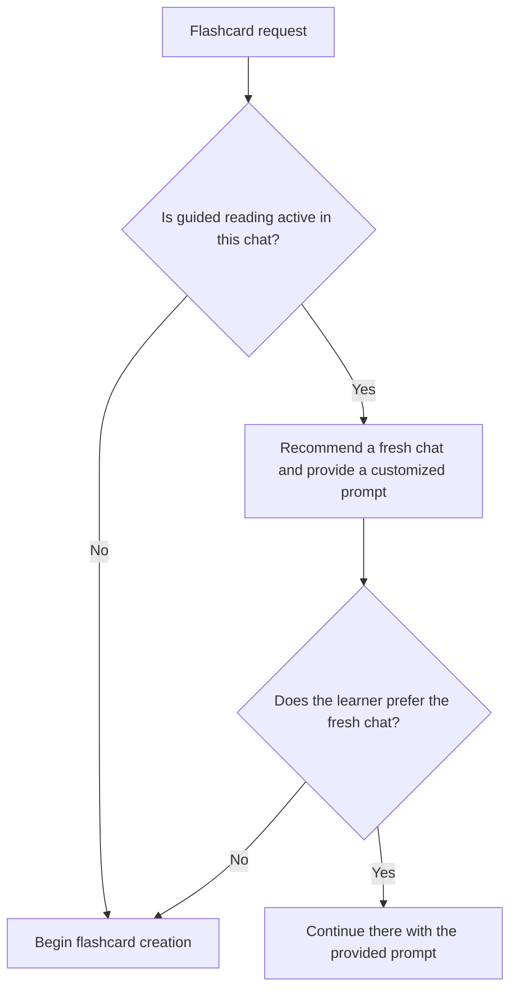
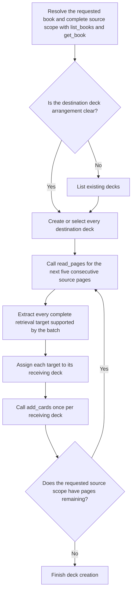

# Create flashcards

Create flashcards independently from guided-reading sessions. Do not require a
session or use its cursor.

Name the actual book, source scope, and deck arrangement in the prompt. For
example:

`@Noggin generate a flashcard deck for Chapter 3 of LLMs for Dummies`

## Generate decks

Use one deck unless the learner requests several logically divided decks.
Honor the requested divisions throughout the source scope.

## Manage decks

- Store source page indices in canonical CSV such as `3,4,9`.
- Use the clearest correct wording while keeping the rendered pages
  authoritative.
- Supply `expected_revision` when updating or deleting a deck or card.
- Deleting a card permanently removes all of its revisions.
- Review revision history when an edit makes a card worse, then use an earlier
  version to repair it.
- Do not rewrite old revisions.

If an update or delete returns a revision conflict, read the current deck state
before deciding whether to retry.

Read [flashcard-best-practices.md](flashcard-best-practices.md) in full before
creating or revising cards.
