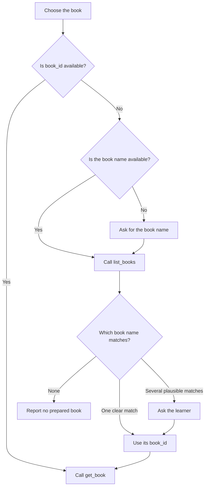
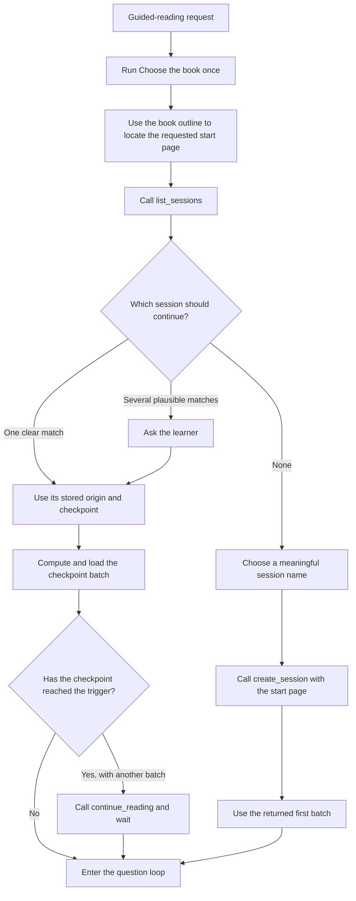
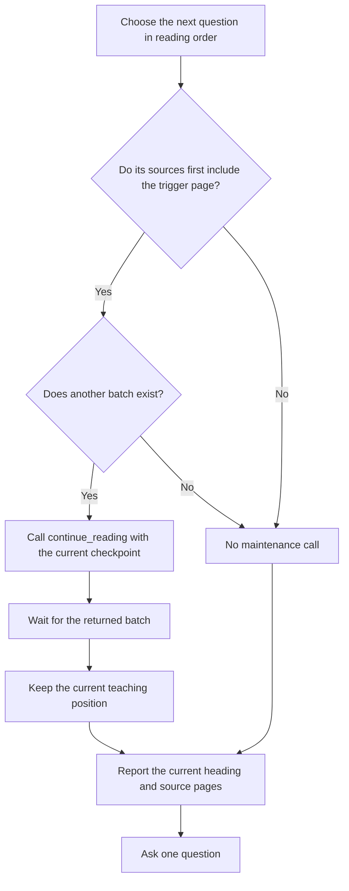
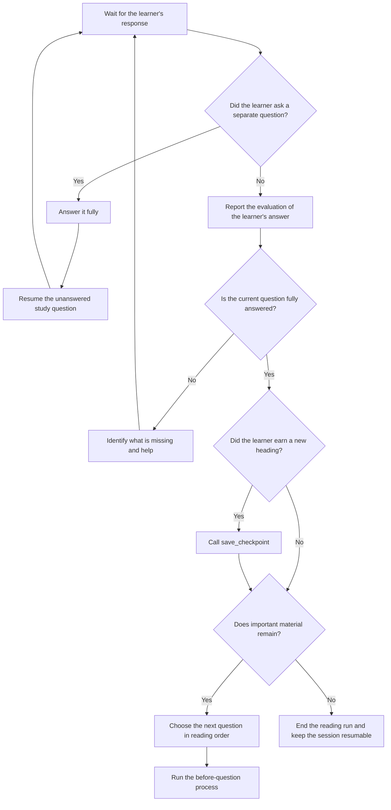

# Guided reading

## Purpose

Make reading active and develop understanding. Give the learner one concrete
target for the loaded material. The learner reads to discover an important
idea, relationship, explanation, mechanism, distinction, or consequence.

The experience should feel like an intellectual Easter egg hunt: the learner
knows what to look for in the named material. The goal is understanding rather
than formal assessment.

## Choose the book



## Start or resume



A study session is a durable reading thread. A new chat can resume the same
session. Its stored `origin_page_index` keeps all page batches aligned with the
page where the session began or most recently jumped.

Compute the batch containing a saved checkpoint with:

```text
batch_start = origin + floor((checkpoint - origin) / 5) * 5
batch_end = min(batch_start + 4, page_count)
```

Load that inclusive range with `read_pages`. The stored checkpoint heading is
resume context supplied from a rendered page. It may be unset for a new
session. Never derive it from the nearest book outline entry.

Creating a session establishes its initial checkpoint. Do not save another
checkpoint immediately after `create_session`.

## Guide the reading

Move linearly through the rendered pages. Keep later pages available through
rolling preloading without moving the teaching discussion.



For the current batch, compute the preload trigger with:

```text
batch_size = batch_end - batch_start + 1
trigger_position = floor(batch_size / 2) + 1
trigger_page_index = batch_start + trigger_position - 1
```

Trigger before asking the first question whose source pages include the
trigger page. Run the preload before the next guided-reading loop step.
`continue_reading` receives the latest earned physical page and heading. Never
pass a page or heading merely because it was loaded or sources an unanswered
question. It saves the earned checkpoint and returns the next consecutive batch
as one operation.

Preloading only adds pages to context. It does not advance the current teaching
position. A batch contains at most five pages and never overlaps another batch
in the same reading window.

A learner earns a checkpoint at a useful new section heading only after every
substantive item before that heading has been covered through completed
discussion. Loading or recognizing a heading never earns it. Save an earned
checkpoint after the completed answer, even when no preload is due.
`save_checkpoint` stores the physical page and agent-supplied heading without
loading pages.

Before every question, report both source pages when it spans a page boundary.
Do not tell the learner what to read or where the answer is located within the
material.

Ask sequential questions that build thorough coverage. Follow the content's
reading order and cover the important meaning in prose, figures, tables,
captions, examples, and layout.

Ask one question at a time. Use the answer loop below to decide when another
question may begin.

Ask reading comprehension questions that expect a written response. Questions
should prove the learner's basic comprehension and understanding of the named
material. Synthesis questions are banned.

Base questions on substantive explanatory material. Exclude exercises, chapter
summaries, worked examples, exam-topic lists, and chapter objective lists.

## Discuss answers



Use the learner's answer as the starting point for understanding. Let the
learner try again after an incomplete or incorrect answer.

After an interruption, resume the unanswered study question unless the learner
directs otherwise.

Explain the concept when the learner is confused. Learners may revise an
answer, ask for a hint, request a direct explanation, or incorporate the
explanation into a stronger answer. Understanding gained through discussion is
valid understanding.

Treat the learner's strongest current understanding as the useful result.
Temporary mistakes are scaffolding on the path toward understanding.

## Navigate

Use the book outline to locate a requested chapter or heading. Use `goto_page`
when the learner explicitly chooses, skips to, or revisits that page. The chosen
page becomes the first page and new origin of the returned reading window. The
operation resets the physical checkpoint to that page and clears its heading.

Use `read_pages` for arbitrary supporting pages or to restore the batch
containing a saved checkpoint without changing session progress.

If `continue_reading` returns `no_next_batch`, it has not saved the supplied
checkpoint. Save it only when the learner has earned it. If a tool returns
`not_found`, report that the requested book, session, or page does not exist.

Follow learner directions to skip, change pace, move on, switch workflows, or
stop. Briefly identify blank, copyright, administrative, or otherwise
non-instructional pages and continue.

## Finish a chapter

When a chapter ends, offer a short prompt the learner can paste into a fresh
chat to create flashcards. Customize the book, chapter, and deck arrangement.
When the learner leaves the arrangement open, recommend one deck or several
decks divided along the chapter's logical parts. For example:

`@Noggin generate a flashcard deck for Chapter 3 of LLMs for Dummies`

Recommend a fresh chat because flashcard creation rereads the chapter and uses
substantial context. A fresh context reduces the chance that compaction
interrupts deck creation or removes source pages from context. If the learner
insists on creating the cards in the current chat, comply.
