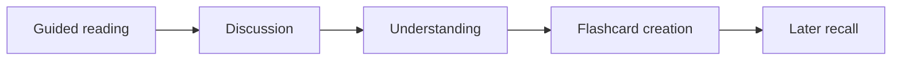
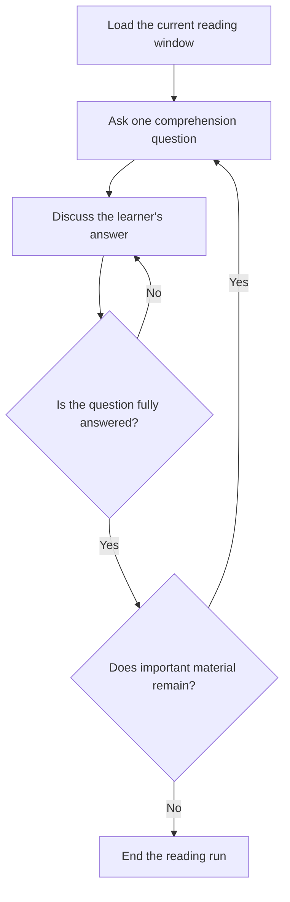

# Using Noggin

This study system helps you move attentively through one prepared book,
understand the material as you encounter it, and create flashcards for later
recall.

The system separates two kinds of work:

Guided reading develops the conceptual structure. Flashcards preserve selected
parts of that structure after the material makes sense.

## Start or resume

Name the book, chapter, or section you want to study. The agent can create a
named study session or resume an existing one. A session remembers the book,
page-window origin, physical checkpoint page, and rendered heading across
chats.

When a new chat resumes, the agent reloads the page batch containing its
durable checkpoint. Reaching the end of the book does not close the session.

## Prepare a book

Book preparation is separate from guided reading. The service renders the PDF
and extracts its existing outline in one import. A PDF without an extractable,
storable outline cannot be imported. The agent does not generate or repair an
outline.

## Why questions come first

After the first pages have been loaded, one purposeful question begins the
study loop. The question provides a target for attention, so discussion becomes
a search for an idea, relationship, mechanism, distinction, or consequence.

The experience is an intellectual Easter egg hunt: you know what you are
currently looking for. The question guides attention while the book remains
the authority for the answer.

## What guided reading feels like

The agent reports the current rendered heading and source page or pages before
every question. Later pages load in consecutive batches without moving the
discussion forward.

## Discuss answers

Your answer begins the discussion. The agent reports its evaluation in the
visible response and helps you complete anything that is missing.

The goal is understanding rather than formal assessment. You can revise an
answer, ask for a hint, request a direct explanation, or use the explanation to
form a stronger answer in your own words. These are normal parts of learning.

You can ask your own questions at any time. The agent answers them fully and
then returns to the unanswered study question unless you choose another
direction.

## Control the session

You can direct the agent to skip, slow down, move faster, change sections,
switch books, change workflows, or stop. The outline helps the agent locate a
requested heading. An explicit jump makes the chosen physical page the start
of a new reading window. Your direction controls the study session.

Prepared books provide an extracted outline and rendered page images. The
service stores the window origin, physical checkpoint page, and heading the
agent read from the rendered page. The agent interprets the material, chooses
questions, evaluates answers, and decides when enough has been covered.

## Create flashcards

Flashcard creation is independent from the guided-reading session. At the end
of a chapter, the agent offers a short prompt for a fresh chat, such as:

`@Noggin generate a flashcard deck for Chapter 3 of LLMs for Dummies`

The prompt names the actual book, chapter, and deck arrangement. You can request
one deck or several decks divided along meaningful parts of the chapter. The
agent can recommend a logical arrangement when you leave that choice open.

Deck creation rereads the complete requested source. That process can consume
enough context to compact a long conversation and remove earlier source pages.
A fresh chat gives card creation room to finish accurately.

The agent can still create the cards in the current chat when you prefer that.
